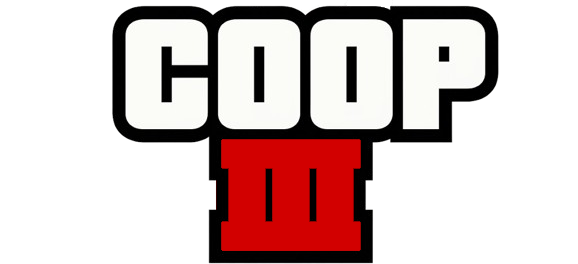

<p align="center">
  
</p>

<hr>

A co-op mod for Grand Theft Auto III. It hooks the retail `gta3.exe` directly
instead of shipping a modified binary, so it needs a legit copy of the game to
run.

Still being built. Networking and vehicles work and players can see each other
in the city; there's more detail at the bottom.

## Disclaimer

Unofficial mod, requires a legitimate copy of GTA III. No Rockstar files or
assets are included here, everything in this repo was written from scratch.
Not affiliated with Rockstar Games or Take-Two. Non-commercial, just a
personal project.

## Why this exists

III never got a proper co-op mod. This is an attempt at building one, by
injecting into the real executable rather than working off a decompiled
recreation.

## Layout

- `sdk/` - wire protocol and the ENet transport, shared by client and server
- `server/` - the dedicated server, builds and runs today
- `client/` - the DLL that gets injected into `gta3.exe`
- `launcher/` - starts the game with the mod attached
- `tools/` - standalone tests that don't need the game running
- `docs/` - protocol notes and design decisions

## Building

Needs [xmake](https://xmake.io/) and MSVC. Target is 32-bit since that's what
`gta3.exe` is:

```
xmake f -p windows -a x86 -y
xmake
```

## Where it's at

Networking, the roster and vehicles (spawning, driving, syncing) all work, and
players can see each other walk, drive and ride along. Combat is written but
untested in a running game. After that: the rest of the world, and eventually
the campaign itself, playable co-op.

Full roadmap in `docs/roadmap.md`.

## Licence

MIT, see [LICENSE](LICENSE). Use it, fork it, build on it. The only thing you
have to do is keep the copyright notice and the licence text with it.

The licence covers CoopIII's own code. It says nothing about Grand Theft Auto
III itself, which is Rockstar's, and you need your own copy of the game to run
any of this.
