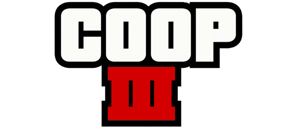
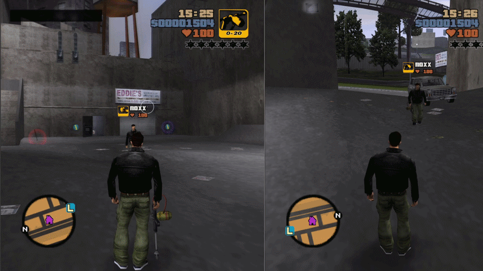

<p align="center">
  
</p>

<hr>

A co-op mod for Grand Theft Auto III. It hooks the retail `gta3.exe` (v1.0)
directly instead of shipping a modified binary, so it needs a legit copy of the
game to run.

Up to 8 players share one Liberty City, and the story can be played together:
one player starts a mission and everybody else plays it with them.

Still in active development. Most of the game is synced now, but a lot of it
has only had short sessions in a real game, and playtesting keeps turning up
bugs that get fixed as they're found. Expect rough edges.

<hr>

## Demonstration

<p align="center">
  
</p>

## Disclaimer

Unofficial mod, requires a legitimate copy of GTA III. No Rockstar files or
assets are included here, everything in this repo was written from scratch.
Not affiliated with Rockstar Games or Take-Two. Non-commercial, just a
personal project.

## Why this exists

III never got a proper co-op mod. This is an attempt at building one.

## What's synced

**Free roam**

- Players: movement, animations, the weapon in hand and where it's aimed,
  health and armour, Claude's clothes. Nametags over everyone and an arrow on
  the radar.
- Cars and boats: driving, passengers (G takes a free seat), getting in and
  out through the game's own animations, carjacking, damage, fire and wrecks,
  horn, siren, alarms, and the radio (everybody in a car hears the same
  station).
- Combat: shots, melee, explosions, fire and the flamethrower, car bombs and
  mines. Friendly fire is off by default.
- Passenger drive-bys: from a passenger seat you can aim with the mouse and
  fire a pistol or an uzi out of any window.
- Traffic and pedestrians: everybody sees the same crowd, and it fights
  everybody.
- Cops and the wanted level, per player by default (riding with a wanted
  player shares the heat), the police helicopter, Pay'n'Spray and bribes.
- The world: clock and weather, trains and planes, traffic lights, pickups
  (one player gets each), hidden packages, rampages (with a vote), garages,
  the scripted gates, breakable street objects, medics and fire trucks,
  cheats.

**The story**

- One mission at a time for the whole session. It runs on the game of the
  player who started it, and everybody else follows it on theirs.
- The mission only starts once everybody is at the marker, and every
  checkpoint waits for everybody (up to 60 s).
- Everybody sees what the mission shows: the text, the blips, the mission's
  cars and enemies, the pickups, and the cutscenes, which everybody watches
  together and can vote to skip.
- Everybody gets paid. A death fails the mission for everybody, like in
  single player (it's a server setting).
- Progress is shared, so the next missions unlock for everybody, and someone
  joining late catches up.
- Mission enemies can be made tougher, or more of them, for bigger groups.

**Around it**

- A dedicated server, with a window (log, players, kick, settings) or
  `--nogui` for a console.
- A launcher that checks your game, starts it with the mod, and has a lobby
  where the host starts everybody's game at once.
- An installer, CoopIII Setup, that puts the mod, the launcher and the mods it
  was tested with in your game folder, and can take them all out again.
- In game: chat (T), the scoreboard with ping (hold Tab or pin it with F9),
  and `/kick` for the host.

What's missing or still being tested is in
[docs/roadmap.md](docs/roadmap.md), section 7.

## Playing

1. Run CoopIII Setup on your GTA III folder. Tagged releases have it as
   `CoopIII-Setup.exe`, along with `server.exe`. It installs CoopIII, the
   launcher and the Essential Pack (Ultimate ASI Loader, SilentPatch and the
   rest, each downloaded from its authors' own release and checked against a
   hash), and has an Uninstall button that takes it all back out.

   CoopIII needs GTA III **v1.0**. The Steam version is not v1.0, and the
   Setup does not change it: it tells you so and links the
   [Steam to 1.0 downgrade guide on GTAForums](https://gtaforums.com/topic/973108-gta-3-steam-to-10-retail-downgrade-and-moddingfixes-tutorial/)
   (background on
   [PCGamingWiki](https://www.pcgamingwiki.com/wiki/Grand_Theft_Auto_III)).
   Downgrade your own copy following it, keep a backup of the original
   `gta3.exe`, then press Check again in the Setup. CoopIII never ships a
   game executable. Details in [docs/installer.md](docs/installer.md).
2. Whoever hosts runs `server.exe`. It listens on UDP port 2001. On start it
   looks up the public address friends on the internet connect to and shows it
   with a copy button, asks the router to open the port (UPnP), and checks that
   Windows Firewall lets it in, saying what to do about whichever of those did
   not work. The host plays on `127.0.0.1`, since many routers do not loop the
   public address back. Settings go in `CoopIII-Server.ini` next to it, one
   comment per setting.
3. Everybody opens the CoopIII launcher, puts in the server and a name, and
   either joins the lobby or starts on their own.

Starting `gta3.exe` normally still gives you plain single player. The mod only
turns on when the game is started from the launcher.

### Server settings

| Setting | Default | What it does |
|---|---|---|
| `port` | 2001 | UDP port |
| `password` | none | keeps strangers out |
| `lookUpPublicAddress` | true | ask api.ipify.org (or two others) for the public address |
| `openRouterPort` | true | ask the router over UPnP to forward the port while the server runs |
| `friendlyFire` | false | players can hurt each other |
| `wantedLevel` | perplayer | `perplayer`, `shared` or `off` |
| `missionFailOnDeath` | true | anybody dying or busted fails the mission |
| `missionMargin` | 5 | metres from a marker or checkpoint that still count as there |
| `missionEnemies` | original | `original`, `tougher` or `more` |
| `ammoSync` | false | show everybody's real ammo |
| `rampages` | shared | `shared`, `scaled` or `off` |
| `cheats` | shared | `shared`, `personal` or `off` |
| `money` | off | `off`, `own` or `shared` |
| `hiddenPackages` | shared | `shared` or `perplayer` |

## Layout

- `sdk/` - wire protocol and the ENet transport, shared by client and server
- `client/` - the DLL (`CoopIII.asi`) that gets loaded into `gta3.exe`
- `server/` - the dedicated server, window and console
- `launcher/` - starts the game with the mod on, and the lobby
- `installer/` - CoopIII Setup: the Essential Pack, the v1.0 check and uninstall
- `ui/` - the UI code the server, launcher and installer share
- `tools/` - test suites and tools that don't need the game running
- `design/` - the screens the windows are built from
- `docs/` - protocol notes, design decisions and the roadmap

## Building

Needs [xmake](https://xmake.io/) and MSVC. Target is 32-bit since that's what
`gta3.exe` is:

```
xmake f -p windows -a x86 -m release -y
xmake
```

## Credits

re3 was used as a reference, a map of where to look in the retail executable.
No re3 code is in this repo, and the addresses the mod relies on were checked
against `gta3.exe` itself.

## Licence

MIT, see [LICENSE](LICENSE). Use it, fork it, build on it. The only thing you
have to do is keep the copyright notice and the licence text with it.

The licence covers CoopIII's own code. It says nothing about Grand Theft Auto
III itself, which is Rockstar's, and you need your own copy of the game to run
any of this.
